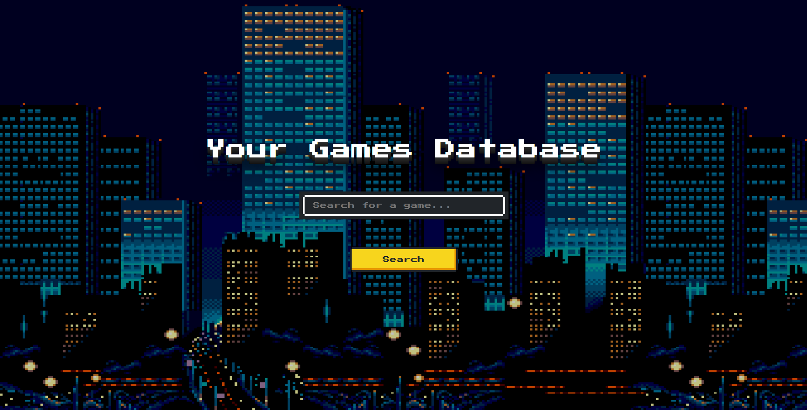

# Your Games Database

## Description:

A video game database, where you can find informations about all the games. This website is using [IGDB database](https://www.igdb.com/). You can also listen to a retro music while searching for the games.
 
## Live Demo
[Your Games Database - Live Preview](https://cenora6.github.io/Your-Games-Database/)

## Technologies and additional dependencies:

| Tool | Description |
| :-------------:|--------------|
| HTML5 | A markup language used for structuring, and presenting content on the World Wide Web. |
| [React (Hooks)](https://www.npmjs.com/package/react/) | A JavaScript library for creating user interfaces. |
| [React Router Dom](https://www.npmjs.com/package/react-router-dom/) | DOM bindings for React Router. |
| [SASS](https://www.npmjs.com/package/sass/) | A preprocessor scripting language that is interpreted or compiled into CSS.  |
| [Node Sass](https://www.npmjs.com/package/node-sass/) | A library that provides binding for Node.js to LibSass, the C version of the popular stylesheet preprocessor, Sass. |
| [Axios](https://www.npmjs.com/package/axios/) | Promise based HTTP client for the browser and node.js |
| [nes.css](https://www.npmjs.com/package/nes.css/) | A NES-style(8bit-like) CSS Framework. |
| [cors-anywhere](https://www.npmjs.com/package/cors-anywhere/) | A NodeJS proxy which adds CORS headers to the proxied request. |
| [React Transition Group](https://www.npmjs.com/package/react-transition-group/) | A set of components for managing component states (including mounting and unmounting) over time, specifically designed with animation in mind. |

## Installation:
[node.js](http://nodejs.org/download/) is required to use ``npm``.

-  ```git clone https://github.com/Cenora6/Your-Games-Database.git``` to clone the repository
- ```npm install``` to install all dependencies
- ```npm start``` and ```http://localhost:3000/``` in the browser to preview the website
